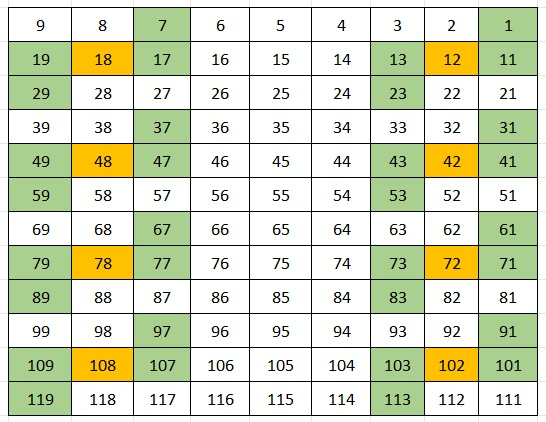
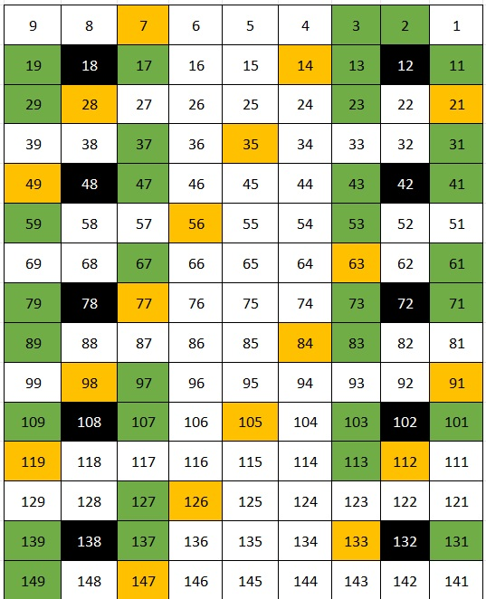
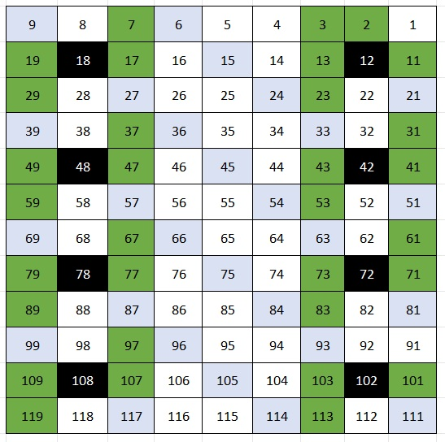

# Prime Matrix Sieve (Table of 9)

An discovery of a new geometric and arithmetic pattern for distributing prime numbers within a 9-column matrix. The pattern demonstrates how prime numbers rotate around specific numerical centers (the orange cells) based on fixed mathematical relationships.

## 📌 Core Concept of the Pattern

When numbers are arranged in a grid with 9 columns (ordered sequentially from right to left as shown in the matrix), the **orange cells** act as central points of symmetry. 

All prime numbers (with the exception of the three initial anomalous primes: `2`, `3`, and `5`) are guaranteed to fall exclusively within the **green cells** surrounding these orange centers. It is mathematically impossible for any other prime number to appear in the white cells.

## 📐 Grid Navigation & Matrix Rules

The entire matrix operates on precise horizontal and vertical stepping rules that allow seamless navigation between the centers and their surrounding elements:

### 1. Rotation Around an Orange Center ($O$)
Each orange cell ($O$) is surrounded centrally by a pattern of key positions (green cells eligible to be primes), easily accessed via:
* **Top/Key Number:** $O - 11$
* **Right Number:** $O - 1$
* **Left Number:** $O + 1$
* **Bottom/Axial Number:** $O + 11$

### 2. Horizontal Translation Between Centers ($\pm 6$)
* To move from a **Right Orange Center** to the corresponding **Left Orange Center** on the same row, **add 6** to its value ($O_{Right} + 6 = O_{Left}$).
* Conversely, to move from a **Left Center** back to the **Right Center**, **subtract 6** ($O_{Left} - 6 = O_{Right}$).

### 3. Vertical Translation Between Rows ($+ 30$)
* To move vertically from any orange center to the center directly underneath it in the next section, **add 30** to its value ($O_{Current} + 30 = O_{Below}$).

> **Note:** The only prime numbers that do not fit into this surrounding rotation are the foundational primes in the first row: `2`, `3`, and `5`.

## 🧪 Proof and Examples From the Matrix

### 🔹 Verifying Horizontal Stepping ($\pm 6$)
* **Row 2:** Start at Right Center ($\mathbf{12}$). Move left: $12 + 6 = \mathbf{18}$ (Left Center).
* **Row 5:** Start at Right Center ($\mathbf{42}$). Move left: $42 + 6 = \mathbf{48}$ (Left Center).
* **Reverse:** Start at Left Center ($\mathbf{78}$). Move right: $78 - 6 = \mathbf{72}$ (Right Center).

### 🔹 Verifying Vertical Stepping ($+ 30$)
* From Center $\mathbf{12}$ to the center below it: $12 + 30 = \mathbf{42}$.
* From Center $\mathbf{42}$ to the center below it: $42 + 30 = \mathbf{72}$.
* From Center $\mathbf{18}$ to the center below it: $18 + 30 = \mathbf{48}$.
* From Center $\mathbf{48}$ to the center below it: $48 + 30 = \mathbf{78}$.

### 🔹 Verifying the Surrounding Rotations
* **Around Center $O = 12$:**
  * Top: $12 - 11 = 1$ | Right: $12 - 1 = 11$ | Left: $12 + 1 = 13$ | Bottom: $12 + 11 = 23$
* **Around Center $O = 78$:**
  * Top: $78 - 11 = 67$ | Right: $78 - 1 = 77$ | Left: $78 + 1 = 79$ | Bottom: $78 + 11 = 89$

---
---

## 🎯 The Magic "+84 Rule" for Multiples of 7

While the green cells contain potential primes, they also contain composite numbers that are multiples of 7. This matrix features a fixed equation that **perfectly predicts the exact relative positions of the multiples of 7**:

$$\text{Predictive Equation: } O_{Current} + 84 = O_{Target}$$

Adding **$+84$** shifts the entire system to a new motion center where the multiples of 7 reappear in the **exact same relative geometric alignment** within their new local neighborhood.

### 🧪 Proof and Examples of the +84 Rule

#### 1️⃣ Example 1: Shift from Center $O = 18$
At Center **18**:
* The number below it is $18 + 10 = \mathbf{28}$ *(Multiple of 7: $7 \times 4$)*.
* The number at the top position is $18 - 11 = \mathbf{7}$ *(Multiple of 7: $7 \times 1$)*.

Applying the formula: $18 + 84 = \mathbf{102}$ (New Target Center).
At Center **102**:
* The number below it is $102 + 10 = \mathbf{112}$ *(Multiple of 7: $7 \times 16$)* $\rightarrow$ *Same relative position as 28!*
* The number at the top position is $102 - 11 = \mathbf{91}$ *(Multiple of 7: $7 \times 13$)* $\rightarrow$ *Same relative position as 7!*

#### 2️⃣ Example 2: Shift from Center $O = 48$
At Center **48**:
* The number at the Left position is $48 + 1 = \mathbf{49}$ *(Multiple of 7: $7 \times 7$)*.

Applying the formula: $48 + 84 = \mathbf{132}$ (New Target Center).
At Center **132**:
* The number at the Left position is $132 + 1 = \mathbf{133}$ *(Multiple of 7: $7 \times 19$)* $\rightarrow$ *Same relative position as 49!*

---

## 🚫 Absolute Exclusion of Multiples of 3, 6, and 9

One of the most powerful structural features of this 9-column layout is that **multiples of 3, 6, and 9 can be completely ignored** when looking for primes. 

Because the grid has a fixed width of 9, all numbers divisible by 3 fall strictly into dedicated vertical channels (the columns containing 3, 6, and 9 at the top row). 
* These channels are colored white or light blue.
* **Rule:** Multiples of 3, 6, and 9 **never intersect or enter the green prime zones**. This geometric separation automatically filters out 33.3% of all composite numbers from your search area.

---

## 🧠 Comprehensive Mathematical Explanation

The structure of this 9-column grid perfectly maps the properties of modular arithmetic:
1. **Mod 9 Base:** By setting the grid width to 9, multiples of 3, 6, and 9 align perfectly into vertical columns, preventing them from ever touching the green zones.
2. **The $+30$ Primorial:** The vertical step of **$+30$** represents $\mathbf{2 \times 3 \times 5 = 30}$, automatically filtering out remaining multiples of 2 and 5 from the green lines.
3. **The $+84$ Periodicity:** The predictive factor of $84$ works flawlessly because $84 \equiv 0 \pmod 7$ and $84 \equiv 0 \pmod 6$. This preserves the relative modular residue of any surrounding cell when shifting by 84, providing an exact visual radar for where multiples of 7 will terminate potential prime lines.

## 🚀 How to Contribute?
Feel free to open an `Issue` or submit a `Pull Request` if you write a script (Python / JavaScript) that generates this matrix dynamically for numbers greater than 100.
